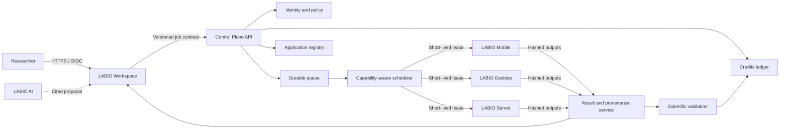
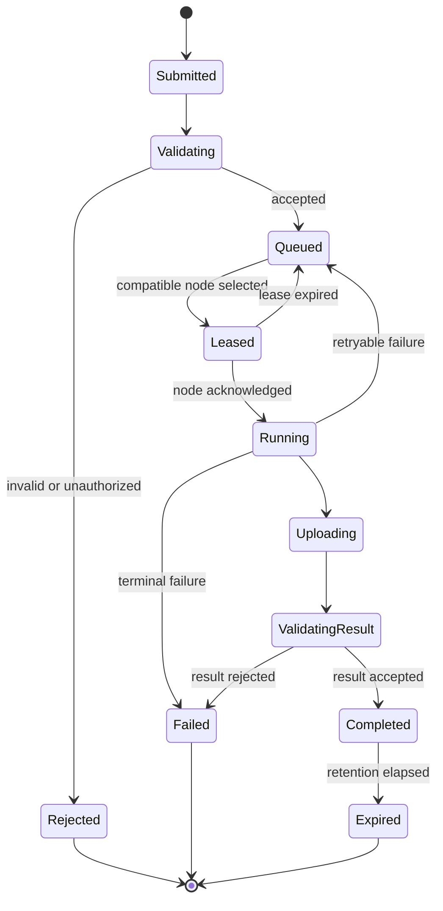

# LABIO.NETWORK reference architecture

**Document status:** public architecture baseline<br>
**Implementation status:** operational prototype with components under active validation

This document defines the public technical boundaries of LABIO.NETWORK. It separates
implemented behavior, architectural requirements and capacity hypotheses. Deployment
topology, credentials, private endpoints and personal data are intentionally excluded.

## System context



The control plane authorizes and coordinates work. Compute nodes obtain assignments
through authenticated outbound connections, so a participant does not need to expose a
home or institutional device directly to the internet.

## Component contracts

| Boundary | Input | Output | Required properties |
|---|---|---|---|
| Identity | OIDC assertion or first-party credential | Session and scoped authorization | Account linking, revocation, auditability |
| Job API | Application ID, parameters, input references, policy | Immutable job ID and accepted state | Schema validation, idempotency key, authorization |
| Scheduler | Pending job and node capabilities | Time-bounded assignment lease | Compatibility, locality, fairness, policy enforcement |
| Node agent | Signed assignment and approved runtime | Result manifest and execution telemetry | Isolation, limits, heartbeat, deterministic cleanup |
| Result service | Output objects, hashes and manifest | Validated result record | Integrity, provenance, retention policy |
| Credits ledger | Authorized debit/credit event | Append-only balance mutation | Idempotency, reconciliation, auditable reason |

Contracts should be versioned independently. Additive fields remain backward-compatible;
breaking changes require a new contract version and a documented migration window.

## Canonical data model

| Entity | Stable identity | Selected relationships |
|---|---|---|
| Account | opaque account ID | projects, devices, ledger entries |
| Device | random device ID | owner, capabilities, policy, heartbeats |
| Application | name plus semantic version | runtime image, schemas, validation profile |
| Job | immutable job ID | requester, application, input manifest, state |
| Assignment | lease ID | job, device, expiry, attempt number |
| Result | result ID plus content hashes | job, assignment, validation, retention |
| Ledger entry | immutable transaction ID | account, job or contribution event, amount |
| Provenance record | provenance ID | inputs, application, parameters, execution, outputs |

Public statistics are derived aggregates. They must not expose the mapping between an
account and a physical device or any exact device location.

## Scheduling and execution

A node is eligible only when all hard constraints match: architecture, operating system,
runtime, memory, accelerator, application allow-list, data classification and participant
policy. Soft ranking may then consider queue fairness, reliability, estimated completion
time, energy policy and data locality.

```text
eligible = compatible AND authorized AND available AND policy_allowed

rank = f(queue_fairness, reliability, estimated_runtime, data_locality, energy_policy)
```

The ranking function is an implementation decision, not a scientific result. Its inputs,
weights and changes require versioning and operational evaluation. Kubernetes-native
admission and quota concepts such as Kueue are relevant to institutional pools
([R10](../references.md#r10)).

## Job state machine



Assignments use a lease and attempt number. Submission, result acceptance and ledger
mutation must be idempotent. A late result from an expired attempt cannot settle credits
twice. Detailed scientific provenance follows concepts from W3C PROV-O
([R3](../references.md#r3)).

## Security model

- Treat accounts, devices, jobs, applications and data as distinct trust domains.
- Authenticate every service and node interaction; network location alone grants no trust.
- Use short-lived, scoped credentials and rotate device enrollment material.
- Sign and identify runtime artifacts by digest; maintain a verifiable build chain.
- Encrypt transport and stored sensitive data; keep secrets outside source control.
- Separate public, restricted and regulated workloads before scheduling.
- Record security-relevant events without storing raw secrets or unnecessary personal data.

This direction follows zero-trust principles from NIST SP 800-207
([R1](../references.md#r1)) and software supply-chain levels from SLSA
([R5](../references.md#r5)). OCI manifests provide content-addressable,
multi-platform runtime metadata ([R4](../references.md#r4)).

## Reliability and observability

| Area | Required mechanism | Public maturity |
|---|---|---|
| Queue durability | persisted state and explicit acknowledgement | Prototype validation |
| Worker loss | heartbeat, expiring lease and safe requeue | Prototype validation |
| Duplicate delivery | idempotent result and ledger operations | Architectural requirement |
| Artifact integrity | cryptographic digest and signed manifest | Planned hardening |
| Metrics | API, queue, scheduler, node and validation telemetry | In development |
| Tracing | correlation across job, assignment and result | Planned |
| Recovery | tested backup and restore procedures | Deployment-specific |

Numerical service-level objectives will be published only after representative load,
failure-injection and recovery benchmarks. OpenTelemetry and Prometheus are reference
technologies for portable telemetry ([R11](../references.md#r11),
[R12](../references.md#r12)).

## Capacity claims

“100,000 smartphones” and “100 servers” are analytical scenarios rather than deployed
inventory. Any comparison must report node class, workload, useful throughput, failure
rate, energy, network transfer, validation overhead and reproducibility. The same rule
applies to expected A100 infrastructure and H100 acquisition proposals: installed model,
memory, form factor and measured benchmark must be known before an aggregate performance
claim is made ([R13](../references.md#r13),
[R14](../references.md#r14)).

## Decision records still required

- job and result schema versioning policy;
- transport choice for node assignment and heartbeat;
- object-storage and retention implementation;
- trusted runtime signing and verification profile;
- scheduler fairness policy and credit settlement formula;
- institutional federation and restricted-data policy;
- production SLOs, RPO and RTO after benchmarks.

These are deliberately recorded as open engineering decisions rather than implied
production capabilities.
